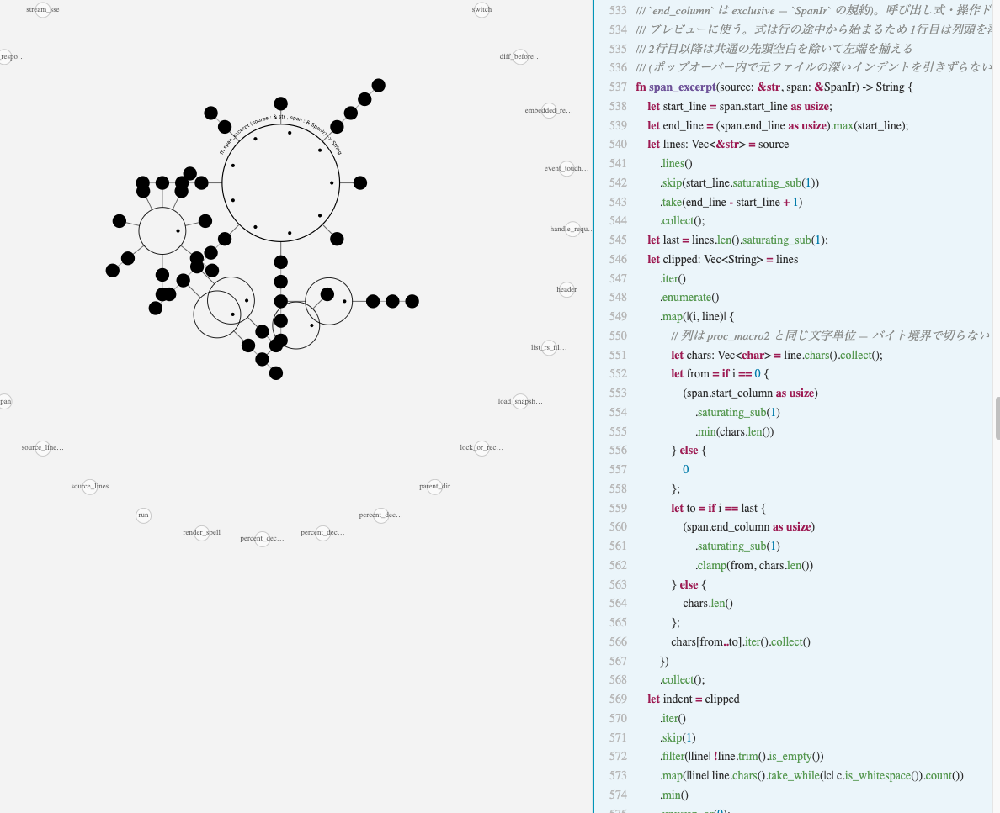
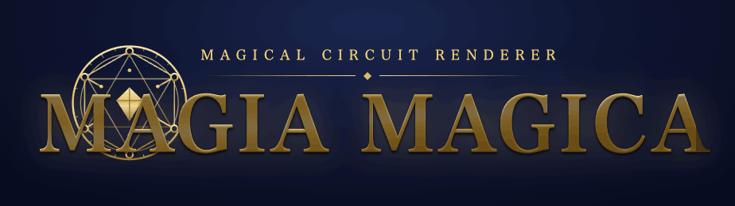

<p align="center">
  
</p>

# まぎあマギカ計画 (MagiaMagica)

コードベースを「魔法陣」として描画する可視化システム。

プログラムの構造を、ファンタジー世界の魔法陣として空間にマッピングする。単なるビジュアル趣味ではなく、**空間認知（近接・グルーピング・境界・対立）を母語とする思考者のためにコードを翻訳する装置**である。フローチャートより魔法陣のほうが「読める」人のための可視化ツール（[コンセプト文書](project-docs/concept.md) より）。

現状の対応言語は **Rust**（`syn` ベースの構文解析）。1関数 = 1枚の魔法陣を基本単位とし、CLI / Web UI / CI のいずれからも引ける。



*`magia serve` の実行イメージ。`span_excerpt` 関数 — 中央の魔法陣からメソッドチェーンが鎖として伸び、`.map(|(i, line)| {...})` のクロージャが補助陣として直交方向に枝分かれする。右ペインはソースの該当箇所。*

## できること

- **静止画 SVG として描画する** — `magia render`。同心円のミッドチルダ式と、データフローを三角力場として描くベルカ式の2流派
- **Web UI で対話的に読む** — `magia serve`。保存のたびに live-reload、関数切り替え、ピン中心ビュー、ホバープレビュー、ワークスペース俯瞰、メソッドチェーンの鎖化、呼び出しジャンプ
- **構造差分を取る** — `magia diff`。同一関数の2リビジョン間で何が増えた/変わった/消えたかをハロー付き SVG または JSON で出す。Web 上でも `?diff=<rev>` で live diff
- **CI に組み込む** — `magia changed --git origin/main`。変更関数を列挙し、PR に Spell Diff コメントを自動投稿（`--fail-on-new-unsafe` で unsafe 新規追加を fail にできる）
- **アクセシビリティ用に書き起こす** — `magia transcribe`。魔法陣の構造をテキストで要約

## インストール

```bash
cargo install --path crates/magia-cli
```

ビルドには **Bun** が必要（[https://bun.sh](https://bun.sh)）。`magia-cli` の `build.rs` が Web UI（SPA）と静止画レンダ（Vue SSR の単一実行ファイル `magia-render`）を Bun でビルドする。

`cargo install` 版から静止画レンダを使うときは `MAGIA_RENDER_PATH=<repo>/target/magia-render` を指定する（リポジトリ内の `target/debug/magia` ならパス解決される）。

## 使い方

### 関数を魔法陣 SVG として描画する

```bash
magia render fixtures/simple_compute.rs --fn simple_compute -o simple_compute.svg
```

`-o` を省略すると標準出力に SVG を吐く。`--layers control_flow,effects,type_info`（カンマ区切り）または `--filter <FILE>.magia`（spec v0.3 §8 のフィルタ DSL）でレイヤーを絞り込める。`--style belka` でベルカ式（三角力場・データフロー）になる。

```bash
# 効果カテゴリ (色相) のレイヤーだけ描画
magia render fixtures/io_print.rs --fn io_print --layers effects

# ベルカ式で描画
magia render fixtures/loop_accumulate.rs --fn loop_accumulate --style belka -o belka.svg
```

### Web UI で対話的に読む

```bash
magia serve crates/magia-core/src/render/midchilda.rs
# http://127.0.0.1:4747 が開く。保存のたびに自動再描画
```

- ヘッダのドロップダウンでファイル切替、関数チップで関数切替（URL に `?file=` / `?fn=` で復元）
- 召喚印クリックで関数間ジャンプ、ホバーで呼び出し式とソース断片のプレビュー
- 「俯瞰」ボタンでワークスペース全体のファイルカード一覧 → クリックでズームイン
- 「差分」入力に rev を入れると `?diff=<rev>` で構造差分をオーバーレイ（live diff）

Web 開発時は二段構成で起動できる:

```bash
scripts/dev-web.sh crates/magia-core/src/render/midchilda.rs
# magia serve (API, 4747) + vite (HMR, 5173) が並走する
```

### 構造差分を取る (Spell Diff)

```bash
# 作業ツリー vs git のリビジョン
magia diff crates/magia-core/src/render/midchilda.rs --git HEAD~1 --fn render_spell --svg -o diff.svg

# JSON で要約（CI 連携用）
magia diff before.rs after.rs --fn process_order --json
```

差分の意匠: **金ハロー = 追加 / シアンハロー = 変更 / 灰の破線ゴースト = 削除**。

### CI に組み込む

```bash
# origin/main から変更された関数を列挙
magia changed --git origin/main --json

# unsafe 新規追加で fail させる (CI で唯一の fail 条件)
magia changed --git origin/main --fail-on-new-unsafe
```

PR への Spell Diff コメントは `scripts/spell-diff-report.sh` を CI から呼ぶ。

### 中間表現を見る

```bash
magia emit-ir fixtures/result_chain.rs --fn result_chain    # MagiaIR を JSON で
magia transcribe fixtures/result_chain.rs --fn result_chain # 構造のテキスト書き起こし
magia list fixtures/match_dispatch.rs                       # ファイル内の関数一覧
```

### 自己ホスティング

このリポジトリ自身を描画サンプルとして使える:

```bash
magia render crates/magia-core/src/layout/mod.rs --fn layout_with -o layout_with.svg
magia serve crates/magia-cli/src/serve.rs
```

## 読み方 (ミッドチルダ式)

- **メインリング** = 関数本体。3時の位置を起点に反時計回りに処理（ドット）が並ぶ
- **補助リング** = 制御構造（if の分岐先・match のアーム・ループ本体）
- **召喚記号** = 他関数の呼び出し。色相が効果カテゴリ:
  黒 = 純粋計算 / 青 = IO / 紫 = ネットワーク / 緑 = DB / 茶 = ファイルシステム / 赤 = unsafe
- **召喚陣からの鎖** = メソッドチェーン。チェーン途中のクロージャは補助陣として直交方向に生える
- **二重線のメインリング** = `async fn` / **リングを内から外へ抜ける矢印** = 早期リターン (`return` / `?`) / **9時から出る実線・破線の分岐** = Result/Option 戻り値の正常・異常パス

Web UI には凡例パネルが備わっており、実描画コンポーネントがそのまま記号サンプルとして並ぶ（意匠調整に追従する）。

`fixtures/` に効果カテゴリ別の合成サンプルが14本ある。

## 仕様と現状

- 現行仕様: [project-docs/magia/INDEX-v0.5.md](project-docs/magia/INDEX-v0.5.md)（系譜: spec v0.1 → v0.2 → v0.3）
- 解析対象は **Rust 関数**。意味解決はせず、`syn` ベースの構文解析と同ファイル内 `use` 文の機械的展開で近似する。メソッド呼び出しはレシーバ型が分からないため黒（純粋扱い）になる
- レイアウト・描画は決定論的（同じコードからは常に同じ SVG が出る）
- 静止画レンダの **意匠の正は Vue 側**（`web/src/render/`）。`magia render` / `magia diff --svg` は Vue SSR で SVG を生成する（Rust 側は配置 IR のみ確定）

## 開発

```bash
cargo build --workspace
cargo clippy --workspace --all-targets -- -D warnings
cargo fmt --check
cargo test --workspace
cd web && bun run vp check && bun run build
```

詳細は [CLAUDE.repo.md](CLAUDE.repo.md) を参照。

## ライセンス

MIT

---

## アセット

ロゴ素材は `docs/images/` 配下に配置している:

- [`docs/images/logo-readme.png`](docs/images/logo-readme.png) — 明るい README 向け（地色あり、ピンク〜クリーム）
- [`docs/images/magia-readme-gold.png`](docs/images/magia-readme-gold.png) — 暗い背景の README / 配布物向け（濃紺 + 金）

<p align="center">
  
</p>
